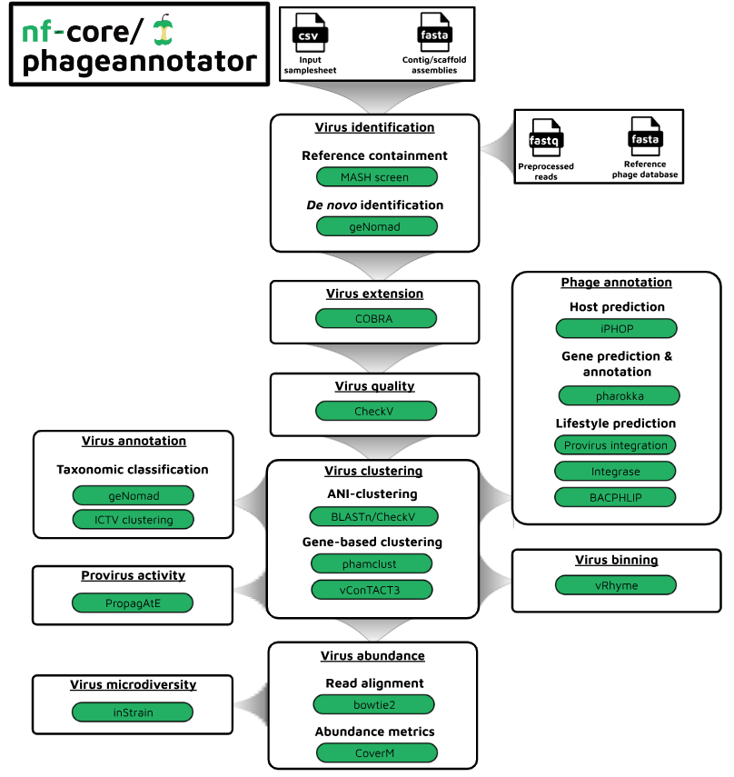

#  

[](https://nf-co.re/phageannotator/results)[](https://doi.org/10.5281/zenodo.XXXXXXX)

[](https://www.nextflow.io/)
[](https://docs.conda.io/en/latest/)
[](https://www.docker.com/)
[](https://sylabs.io/docs/)
[](https://tower.nf/launch?pipeline=https://github.com/nf-core/phageannotator)

[](https://nfcore.slack.com/channels/phageannotator)[](https://twitter.com/nf_core)[](https://mstdn.science/@nf_core)[](https://www.youtube.com/c/nf-core)

## Introduction

**nf-core/phageannotator** is a bioinformatics pipeline for identifying, annotation, and quantifying phage sequences in (meta)-genomic sequences.

<p align="center">
    
</p>

## Pipeline summary

The core identification/quantification portion of this pipeline takes (meta)-genomic assemblies (as output by [**nf-core/mag**](https://nf-co.re/mag/2.3.2)) and performs the following steps:

1. Phage sequence identification
   - _de novo_ identification ([`geNomad`](https://portal.nersc.gov/genomad/))
   - _OPTIONAL_ - reference-based identification ([`mash`](https://mash.readthedocs.io/en/latest/index.html))
2. Quality assessment/filtering ([`CheckV`](https://bitbucket.org/berkeleylab/checkv/src/master/))
3. ANI clustering/dereplication ([`BLAST`](https://blast.ncbi.nlm.nih.gov/doc/blast-help/))([`CheckV`](https://bitbucket.org/berkeleylab/checkv/src/master/))
4. Binning ([`VRhyme`](https://github.com/AnantharamanLab/vRhyme))
5. Abundance estimation ([`bowtie2`](https://bowtie-bio.sourceforge.net/bowtie2/manual.shtml))([`CoverM`](https://github.com/wwood/CoverM))
   - _Output can be used as input for_ [**nf-core/differentialabundance**](https://nf-co.re/differentialabundance/1.2.0)
6. _OPTIONAL_ - Strain profiling ([`inStrain`](https://instrain.readthedocs.io/en/latest/))
7. _OPTIONAL_ - Prophage activity prediction ([`propagAtE`](https://github.com/AnantharamanLab/PropagAtE))

The annotation portion of this pipeline performs the following steps:

1. Marker-based taxonomic classification ([`geNomad`](https://portal.nersc.gov/genomad/))
2. Genome proximity taxonomic classification ([`mash`](https://mash.readthedocs.io/en/latest/index.html))
3. Host prediction ([`iPHoP`](https://bitbucket.org/srouxjgi/iphop/src/main/))
4. Lifestyle prediction ([`BACPHLIP`](https://github.com/adamhockenberry/bacphlip))
5. Protein-coding gene prediction ([`Prodigal-gv`](https://github.com/apcamargo/prodigal-gv))
   - _Output can be used as input for_ [**nf-core/funcscan**](https://nf-co.re/funcscan/1.1.2)

## Quick Start

1. Install [`Nextflow`](https://www.nextflow.io/docs/latest/getstarted.html#installation) (`>=22.10.1`).

2. Install any of [`Docker`](https://docs.docker.com/engine/installation/), [`Singularity`](https://www.sylabs.io/guides/3.0/user-guide/) (you can follow [this tutorial](https://singularity-tutorial.github.io/01-installation/)), [`Podman`](https://podman.io/), [`Shifter`](https://nersc.gitlab.io/development/shifter/how-to-use/) or [`Charliecloud`](https://hpc.github.io/charliecloud/) for full pipeline reproducibility _(you can use [`Conda`](https://conda.io/miniconda.html) both to install Nextflow itself and also to manage software within pipelines. Please only use it within pipelines as a last resort; see [docs](https://nf-co.re/usage/configuration#basic-configuration-profiles))_.

3. Download the pipeline and test it on a minimal dataset with a single command:

   ```bash
   nextflow run nf-core/taxprofiler -profile test,YOURPROFILE --outdir <OUTDIR>
   ```

   Note that some form of configuration will be needed so that Nextflow knows how to fetch the required software. This is usually done in the form of a config profile (`YOURPROFILE` in the example command above). You can chain multiple config profiles in a comma-separated string.

   > - The pipeline comes with config profiles called `docker`, `singularity`, `podman`, `shifter`, `charliecloud` and `conda` which instruct the pipeline to use the named tool for software management. For example, `-profile test,docker`.
   > - Please check [nf-core/configs](https://github.com/nf-core/configs#documentation) to see if a custom config file to run nf-core pipelines already exists for your Institute. If so, you can simply use `-profile <institute>` in your command. This will enable either `docker` or `singularity` and set the appropriate execution settings for your local compute environment.
   > - If you are using `singularity`, please use the [`nf-core download`](https://nf-co.re/tools/#downloading-pipelines-for-offline-use) command to download images first, before running the pipeline. Setting the [`NXF_SINGULARITY_CACHEDIR` or `singularity.cacheDir`](https://www.nextflow.io/docs/latest/singularity.html?#singularity-docker-hub) Nextflow options enables you to store and re-use the images from a central location for future pipeline runs.
   > - If you are using `conda`, it is highly recommended to use the [`NXF_CONDA_CACHEDIR` or `conda.cacheDir`](https://www.nextflow.io/docs/latest/conda.html) settings to store the environments in a central location for future pipeline runs.

4. Start running your own analysis!

   ```console
   nextflow run nf-core/taxprofiler --input samplesheet.csv --databases database.csv --outdir <OUTDIR> --run_<TOOL1> --run_<TOOL1> -profile <docker/singularity/podman/shifter/charliecloud/conda/institute>
   ```

For more details and further functionality, please refer to the [usage documentation](https://nf-co.re/phageannotator/usage) and the [parameter documentation](https://nf-co.re/phageannotator/parameters).

## Documentation

The nf-core/taxprofiler pipeline comes with documentation about the pipeline [usage](https://nf-co.re/phageannotater/usage), [parameters](https://nf-co.re/phageannotater/parameters) and [output](https://nf-co.re/phageannotater/output).

## Credits

nf-core/phageannotator was originally written by @CarsonJM.

We thank the following people for their extensive assistance in the development of this pipeline:

<!-- TODO nf-core: If applicable, make list of people who have also contributed -->

## Contributions and Support

If you would like to contribute to this pipeline, please see the [contributing guidelines](.github/CONTRIBUTING.md).

For further information or help, don't hesitate to get in touch on the [Slack `#phageannotator` channel](https://nfcore.slack.com/channels/phageannotator) (you can join with [this invite](https://nf-co.re/join/slack)).

## Citations

<!-- TODO nf-core: Add citation for pipeline after first release. Uncomment lines below and update Zenodo doi and badge at the top of this file. -->
<!-- If you use  nf-core/phageannotator for your analysis, please cite it using the following doi: [10.5281/zenodo.XXXXXX](https://doi.org/10.5281/zenodo.XXXXXX) -->

<!-- TODO nf-core: Add bibliography of tools and data used in your pipeline -->

An extensive list of references for the tools used by the pipeline can be found in the [`CITATIONS.md`](CITATIONS.md) file.

You can cite the `nf-core` publication as follows:

> **The nf-core framework for community-curated bioinformatics pipelines.**
>
> Philip Ewels, Alexander Peltzer, Sven Fillinger, Harshil Patel, Johannes Alneberg, Andreas Wilm, Maxime Ulysse Garcia, Paolo Di Tommaso & Sven Nahnsen.
>
> _Nat Biotechnol._ 2020 Feb 13. doi: [10.1038/s41587-020-0439-x](https://dx.doi.org/10.1038/s41587-020-0439-x).
